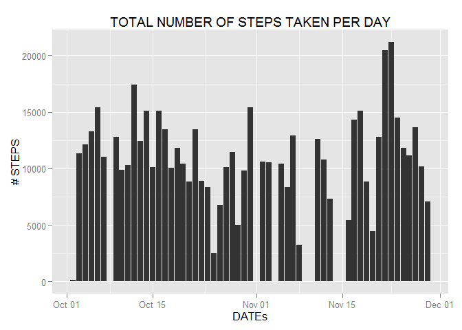
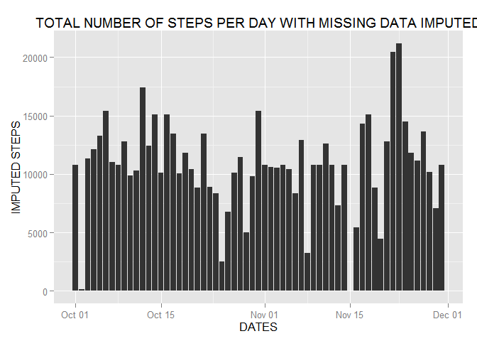
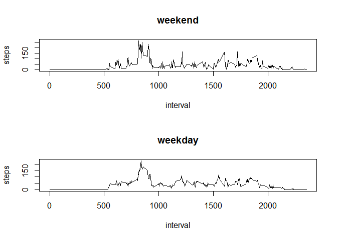

# Reproducible Research: Peer Assessment 1
Kevin Sechowski  


## Loading and preprocessing the data

1. Load the data:

```r
activity <- read.csv("activity.csv",colClasses = c("numeric", "character","integer"))

summary(activity)
```

```
##      steps            date              interval     
##  Min.   :  0.00   Length:17568       Min.   :   0.0  
##  1st Qu.:  0.00   Class :character   1st Qu.: 588.8  
##  Median :  0.00   Mode  :character   Median :1177.5  
##  Mean   : 37.38                      Mean   :1177.5  
##  3rd Qu.: 12.00                      3rd Qu.:1766.2  
##  Max.   :806.00                      Max.   :2355.0  
##  NA's   :2304
```

2. Process/transform the data into a format suitable for analysis:

```r
library(ggplot2)
library(plyr)
library(dplyr)
```

```
## 
## Attaching package: 'dplyr'
## 
## The following objects are masked from 'package:plyr':
## 
##     arrange, count, desc, failwith, id, mutate, rename, summarise,
##     summarize
## 
## The following objects are masked from 'package:stats':
## 
##     filter, lag
## 
## The following objects are masked from 'package:base':
## 
##     intersect, setdiff, setequal, union
```

```r
library(lubridate)
```

```
## Warning: package 'lubridate' was built under R version 3.2.2
```

```
## 
## Attaching package: 'lubridate'
## 
## The following object is masked from 'package:plyr':
## 
##     here
```


## What is mean total number of steps taken per day?
(Ignore missing)
1. Make a histogram of the total number of steps taken each day

```r
activity$date <- ymd(activity$date)

totalsteps <- activity %>%
  filter(!is.na(steps)) %>%
  group_by(date) %>%
  summarize(steps = sum(steps)) %>%
  print
```

```
## Source: local data frame [53 x 2]
## 
##          date steps
## 1  2012-10-02   126
## 2  2012-10-03 11352
## 3  2012-10-04 12116
## 4  2012-10-05 13294
## 5  2012-10-06 15420
## 6  2012-10-07 11015
## 7  2012-10-09 12811
## 8  2012-10-10  9900
## 9  2012-10-11 10304
## 10 2012-10-12 17382
## ..        ...   ...
```

```r
ggplot(totalsteps, aes(x=date, y=steps))+geom_histogram(stat="identity")+ xlab("DATEs")+ ylab("# STEPS")+ labs(title= "TOTAL NUMBER OF STEPS TAKEN PER DAY")
```

 

2. Calculate and report the mean and median total number of steps taken per day

```r
aggtotal.steps <- tapply(activity$steps, activity$date, FUN = sum, na.rm = TRUE)

mean(aggtotal.steps)
```

```
## [1] 9354.23
```

```r
median(aggtotal.steps)
```

```
## [1] 10395
```


## What is the average daily activity pattern?
1. Make a time series plot of the 5-minute interval and the average numver of steps taken, averaged across all days

```r
totaldaily <- activity %>%
        filter(!is.na(steps)) %>%
        group_by(interval) %>%
        summarize(steps=mean(steps)) %>%
        print
```

```
## Source: local data frame [288 x 2]
## 
##    interval     steps
## 1         0 1.7169811
## 2         5 0.3396226
## 3        10 0.1320755
## 4        15 0.1509434
## 5        20 0.0754717
## 6        25 2.0943396
## 7        30 0.5283019
## 8        35 0.8679245
## 9        40 0.0000000
## 10       45 1.4716981
## ..      ...       ...
```

```r
plot(totaldaily, type = "l")
```

 

2. Which 5-minute interval, on average across all the days in the dataset, contains the maximum number of steps

```r
totaldaily[which.max(totaldaily$steps), ]$interval
```

```
## [1] 835
```
## Imputing missing values
Note that there are a number of days/intervals where there are missing values (coded as NA). The presence of missing days may introduce bias into some calculations or summaries of the data.

1. Calculate and report the total number of missing values in the dataset (i.e. the total number of rows with NAs)

```r
missingrows <- sum(is.na(activity))

missingrows
```

```
## [1] 2304
```

2. Devise a strategy for filling in all of the missing values in the dataset. The strategy does not need to be sophisticated. For example, you could use the mean/median for that day, or the mean for that 5-minute interval, etc.

Create a new dataset that is equal to the original dataset but with the missing data filled in.


```r
newdataset <- activity %>%
        group_by(interval) %>%
        mutate(steps = ifelse(is.na(steps), mean(steps, na.rm=TRUE), steps))
```
4. Make a histogram of the total number of steps taken each day


```r
newdataset.steps <- newdataset %>%
  group_by(date) %>%
  summarize(steps = sum(steps)) %>%
  print  
```

```
## Source: local data frame [61 x 2]
## 
##          date    steps
## 1  2012-10-01 10766.19
## 2  2012-10-02   126.00
## 3  2012-10-03 11352.00
## 4  2012-10-04 12116.00
## 5  2012-10-05 13294.00
## 6  2012-10-06 15420.00
## 7  2012-10-07 11015.00
## 8  2012-10-08 10766.19
## 9  2012-10-09 12811.00
## 10 2012-10-10  9900.00
## ..        ...      ...
```

```r
ggplot(newdataset.steps, aes(x=date, y=steps))+geom_histogram(stat="identity")+ xlab("DATES")+ ylab("IMPUTED STEPS")+ labs(title= "TOTAL NUMBER OF STEPS PER DAY WITH MISSING DATA IMPUTED")
```

 

Calculate and report the mean total number of steps taken per day (missing included)

```r
imputedtotal.steps <- tapply(newdataset$steps, newdataset$date, FUN = sum, na.rm = TRUE)
newdataset$date <- ymd(newdataset$date)

mean(imputedtotal.steps)
```

```
## [1] 10766.19
```

Calculate and report the median total number of steps taken per day (missing included).

```r
median(imputedtotal.steps)
```

```
## [1] 10766.19
```

Do these values differ from the estimates from the first part of the assignment? 

```r
mean(aggtotal.steps)==mean(imputedtotal.steps)
```

```
## [1] FALSE
```

```r
median(aggtotal.steps)==median(imputedtotal.steps)
```

```
## [1] FALSE
```


What is the impact of imputing missing data on the estimates of the total daily number of steps?

```r
summary(imputedtotal.steps) - summary(aggtotal.steps)
```

```
##    Min. 1st Qu.  Median    Mean 3rd Qu.    Max. 
##      41    3041     370    1416       0       0
```

## Are there differences in activity patterns between weekdays and weekends?
Create a new factor variable in the dataset with two levels -- "weekday" and "weekend" indicating whether a given date is a weekday or weekend day.

```r
dayofweek <- function(date) {
    if (weekdays(as.Date(date)) %in% c("Saturday", "Sunday")) {
    "weekend"
    } else {
    "weekday"
    }
}
newdataset$daytype <- as.factor(sapply(newdataset.steps$date, dayofweek))
```
Make a panel plot containing a time series plot (i.e. type = "l") of the 5-minute interval (x-axis) and the average number of steps taken, averaged across all weekday days or weekend days (y-axis). 

```r
par(mfrow = c(2, 1))
for (type in c("weekend", "weekday")) {
    steps.type <- aggregate(steps ~ interval, data = newdataset, subset = newdataset$daytype == 
        type, FUN = mean)
    plot(steps.type, type = "l", main = type)
}
```

 


